# Startpages
My collection of startpages that showcase various designs and functionalities....

## Alga-Alligata
> A clean and minimalist startpage featuring a straightforward list layout.
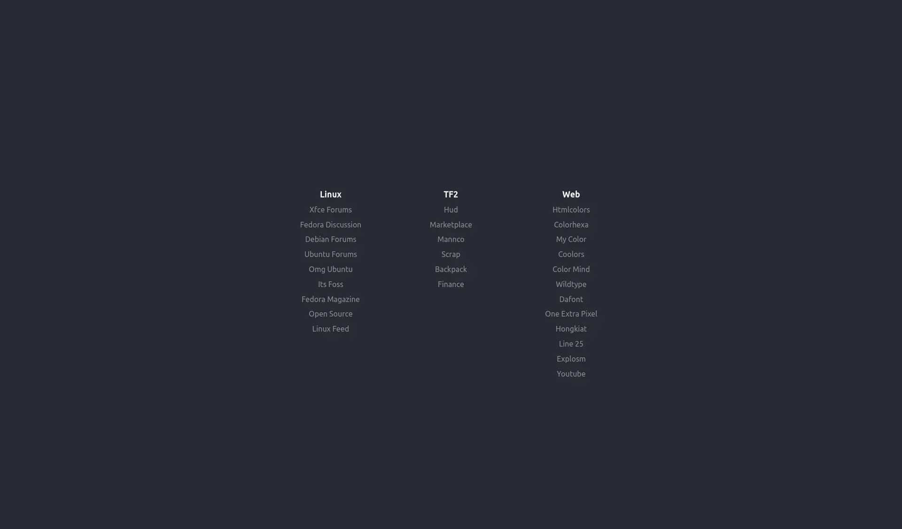
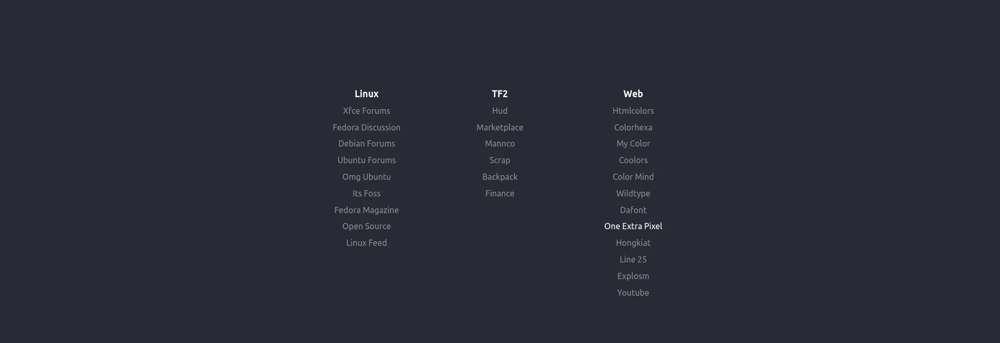

## Anastasiya
> An interactive startpage featuring a randomly changing background video and a curated list of links. It integrates a live clock and dynamic content for a visually engaging experience.

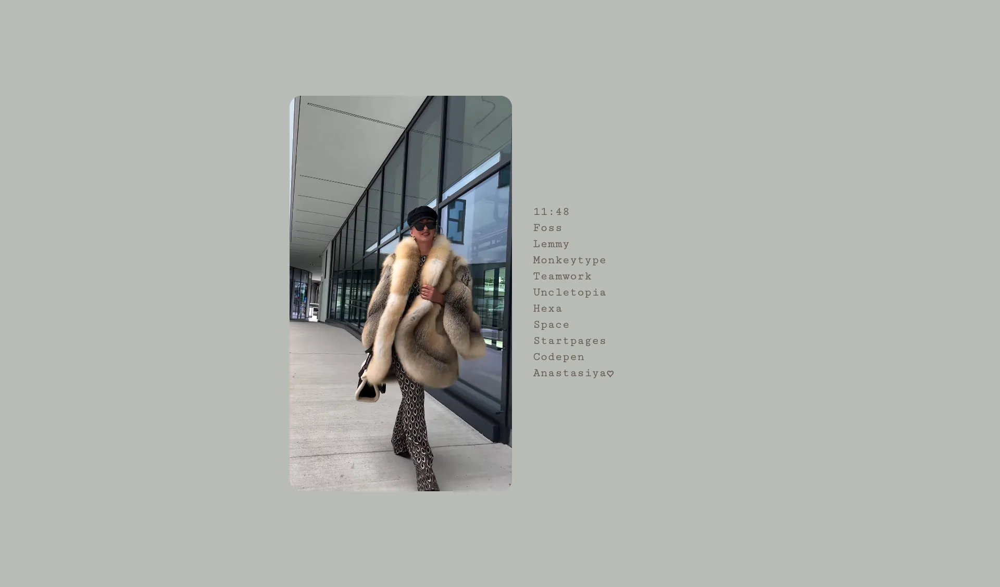

## FF
> A minimalist startpage featuring a dynamic clock, date display, and a curated list of useful links. The design emphasizes simplicity with a focus on utility and real-time information.
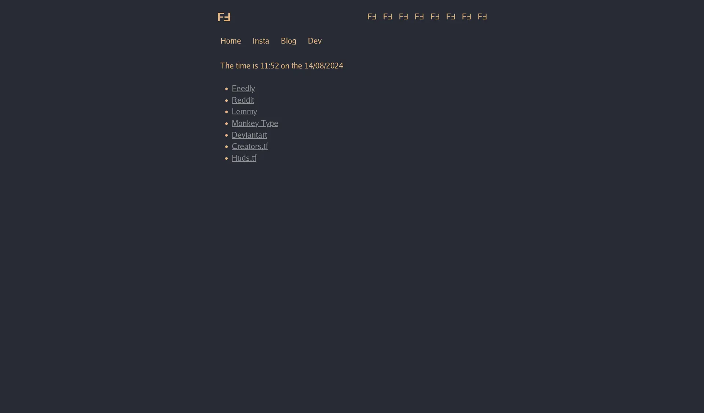

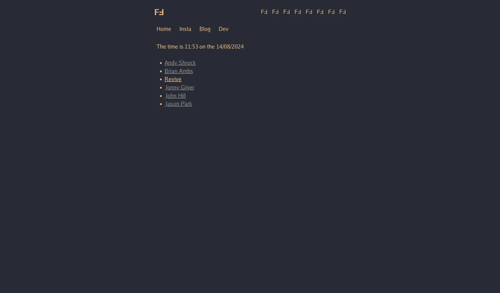

## Fullscreen
> A sleek fullscreen startpage featuring a dynamic menu with interactive elements and a minimalist design. The interface includes a floating plus button and a stylish menu with quick access links.
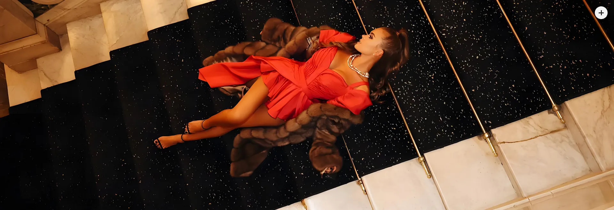
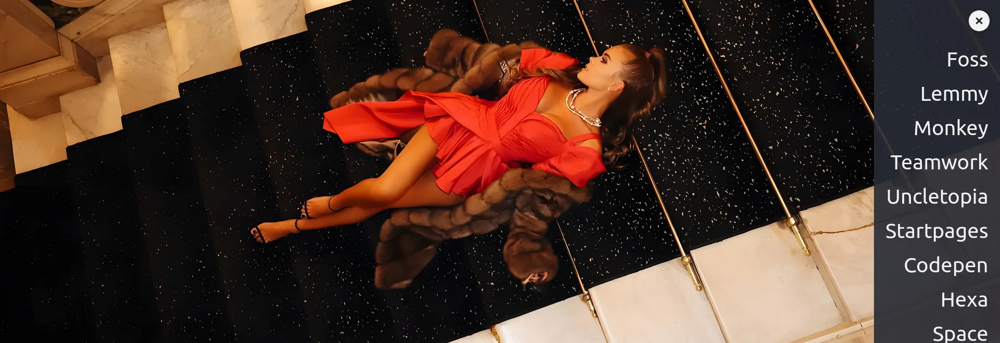
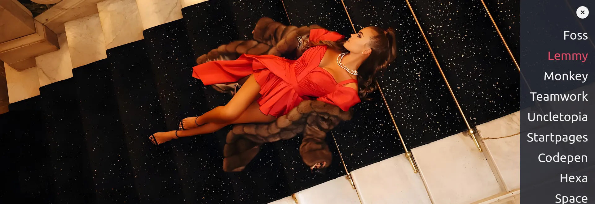

## Mnml
> A minimalist startpage with a central clock and a list of essential links. Designed for simplicity and functionality, it features clean navigation and a focus on core resources.

## Modal
> A dynamic startpage featuring buttons that open modals with categorized links.
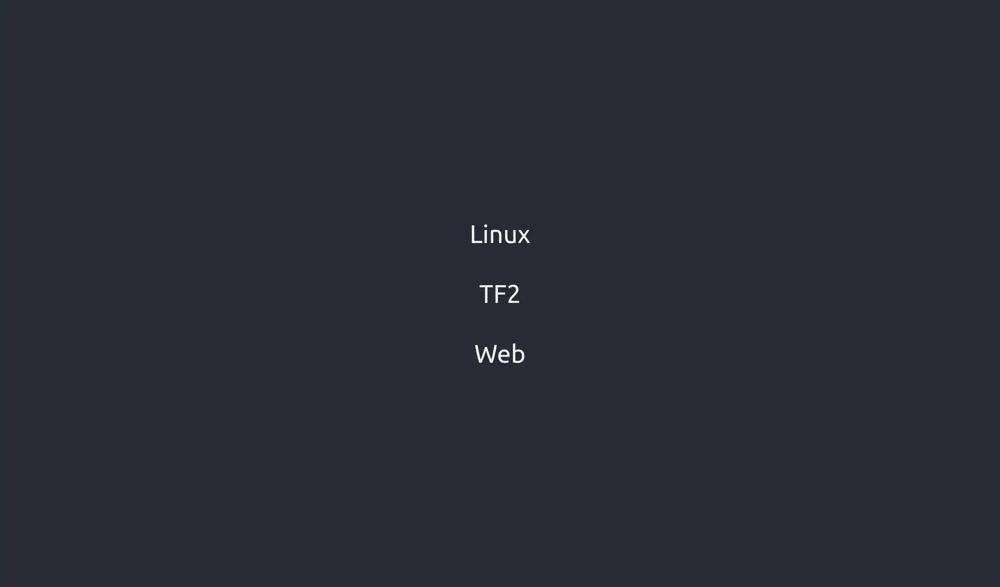

## Motivation
> A minimalist motivational page featuring a personal reflection prompt and a quote attributed to Stevie Sutton and Heather Small.

## Polaroid
> A startpage organized into sections with each presented in a neatly polaroid styled format.
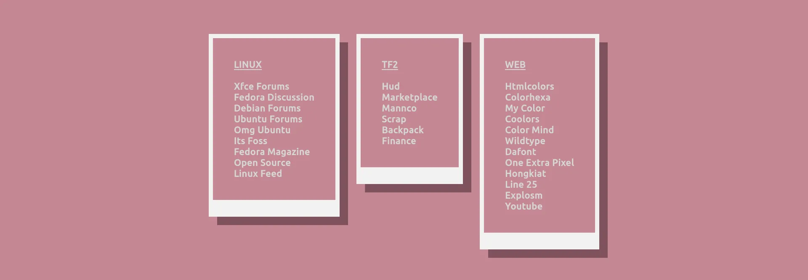
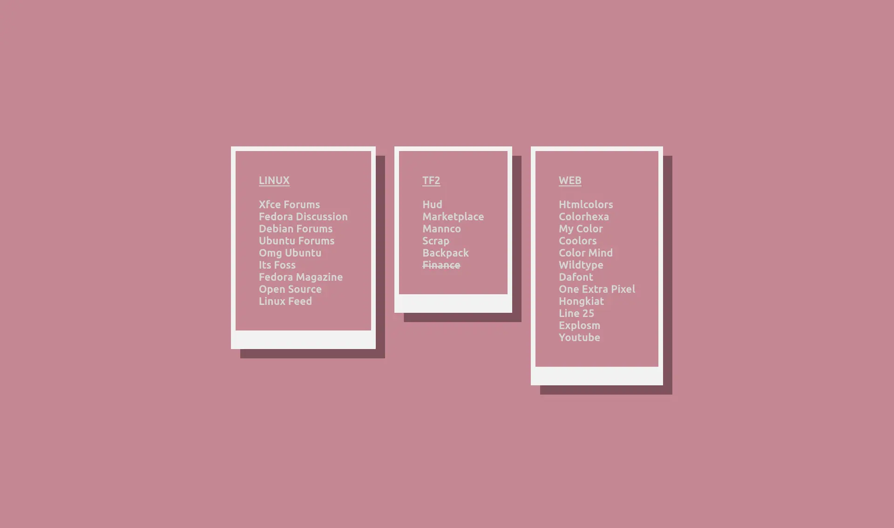

## Portrait
> A startpage with a clickable portrait image that cycles through two images, and a links section providing quick access to various resources and tools.
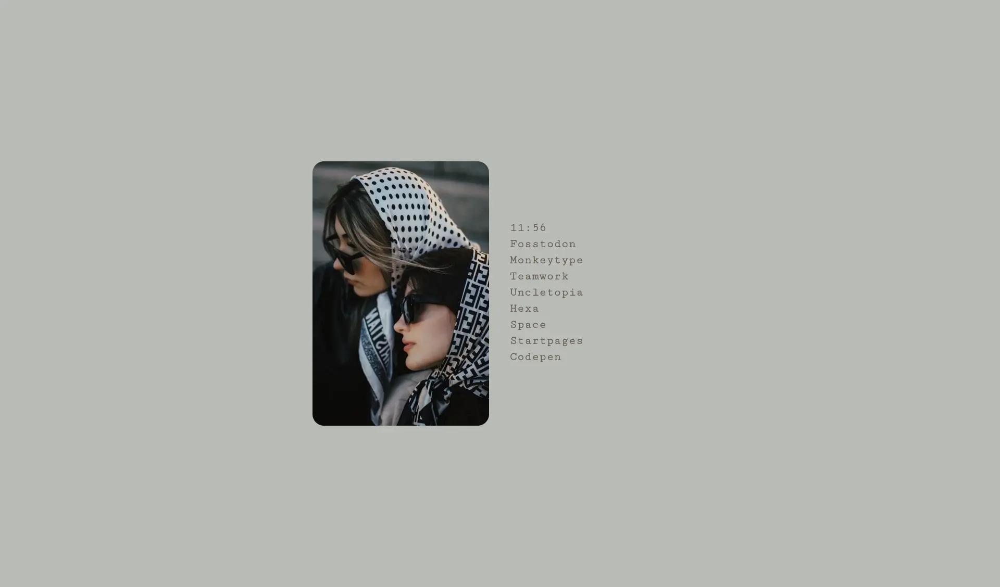
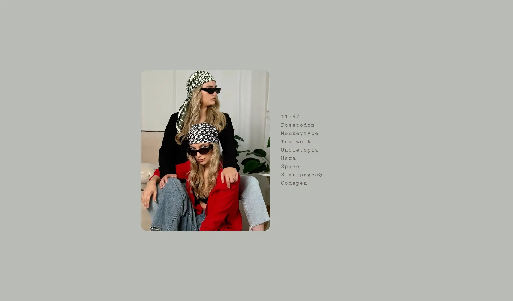

## Searchpage
> A minimal startpage featuring a logo and a search form integrated with Ecosia for quick web searches.

## Sidebar
> A startpage featuring categorized links with a responsive layout and dynamic styling.
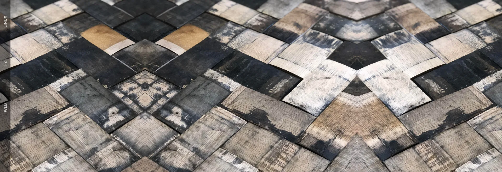
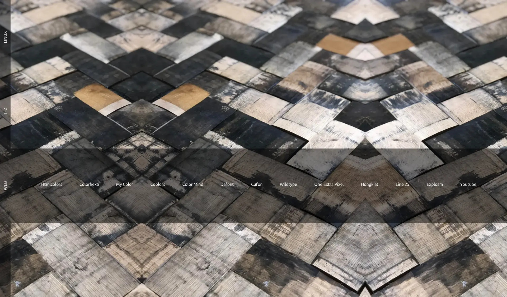
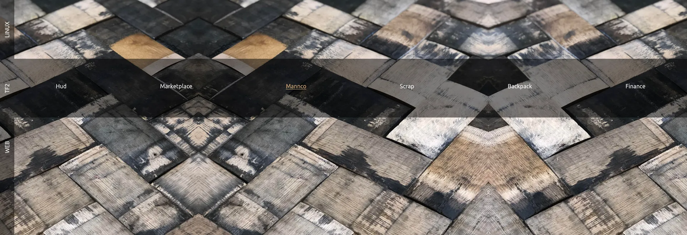

## Tree
> A hierarchical startpage with categorized links styled after the tree command.
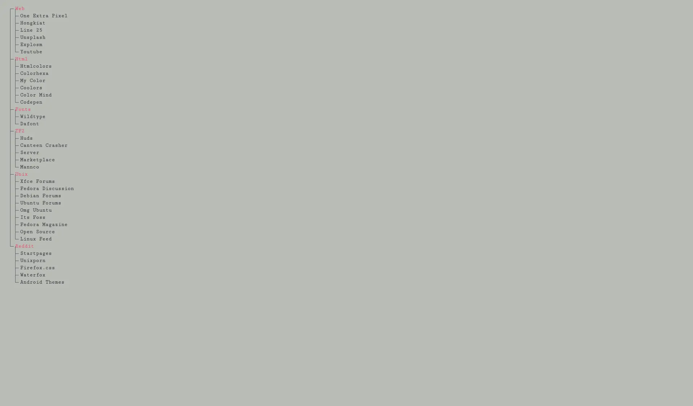
