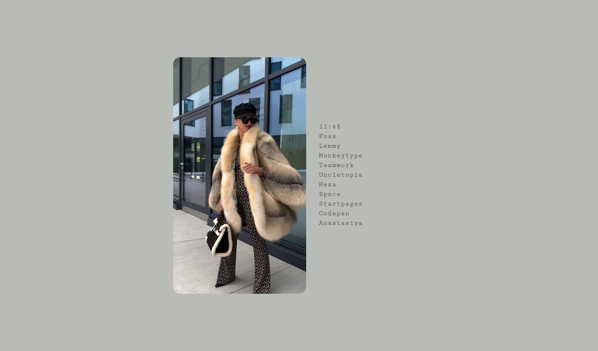
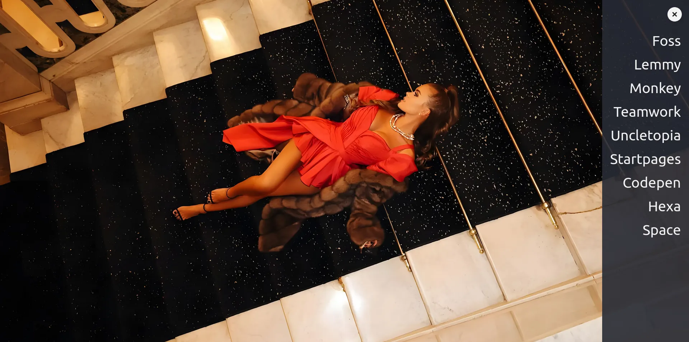
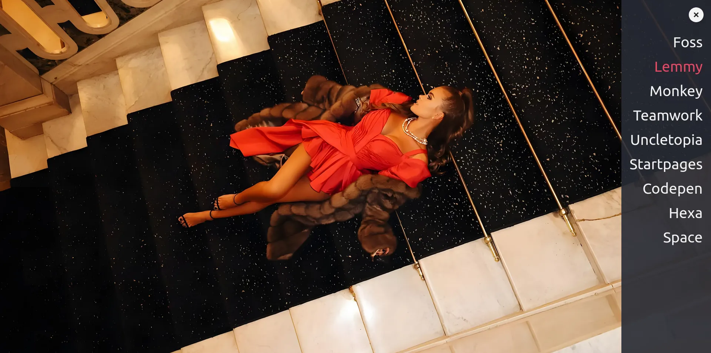
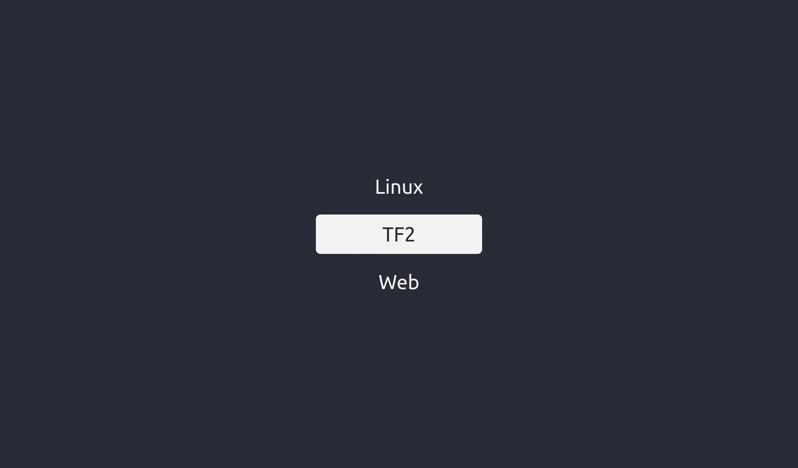
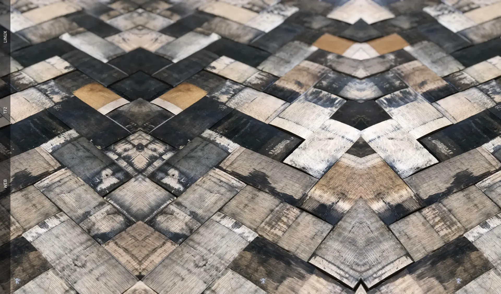

# Startpages
My collection of startpages....

## Alga-Alligata

## Anastasiya

## FF

## Fullscreen

## Mnml

## Modal

## Motivation

## Polaroid

## Portrait

## Searchpage

## Sidebar

## Tree

